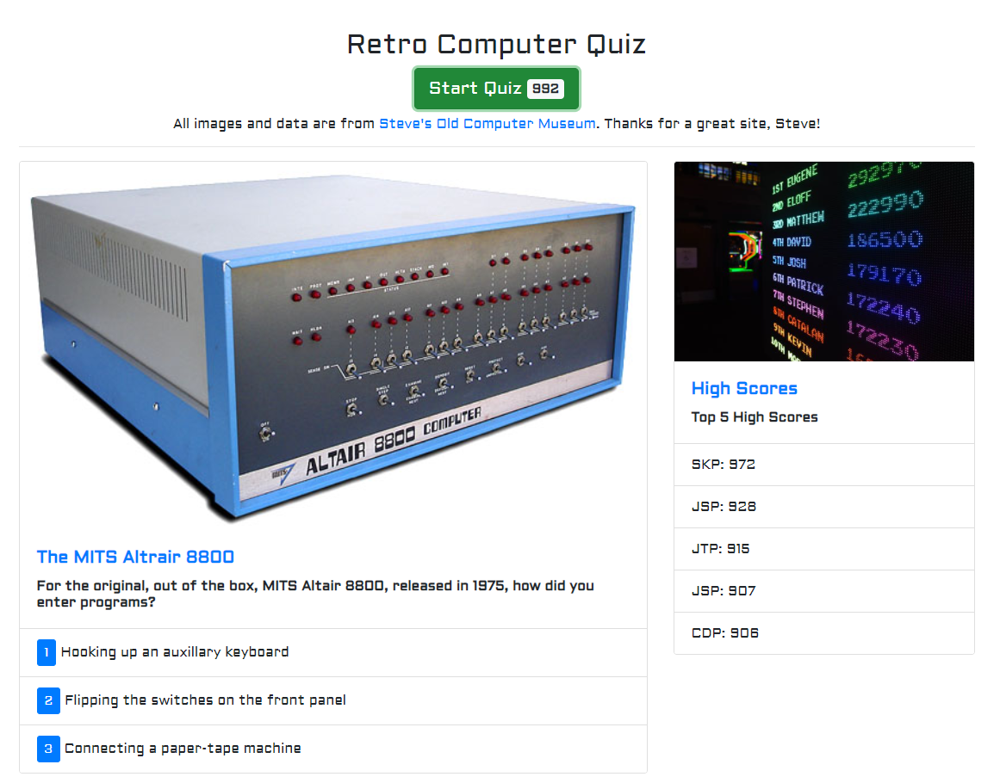

# Retro Computer Quiz

## Introduction

In this assignment we were to create a quiz with a timer utilizing Bootstrap and vanilla JavaScript. Each wrong answer would remove 50 from the timer and the end score would be the remaining time on the timer. In addition, high scores were to be displayed and stored in local storage and the user prompted if they qualified for a high score.

## Approach

To create this quiz, I utilized Bootstrap forms and Javascript logic tied to the HTML elements.
A few notes on the solution:

- For high score initials input, I hid the form from display and showed it only when the user qualified to enter their initials
- All elements of my questions (picture, text, choices, answer) are stored in a single object
- To minimize redundancy, functions were used to display questions, check questions, update high score list, etc.
- JSON was used to store and retrieve the high score array to/from local storage
- During initialization, the program checks to see if the high score array exists in local storage. If it doesn't, it creates a array of TDB's and 0's

## Results

The quiz works well, catches errors, and resets for a new game.

### Path to GitHub Repository

<https://github.com/JonPointer/Retro_Computer_Quiz>

### Path to GitHub Hosted Application

<https://jonpointer.github.io/Retro_Computer_Quiz/>

### Screenshot of the completed application

